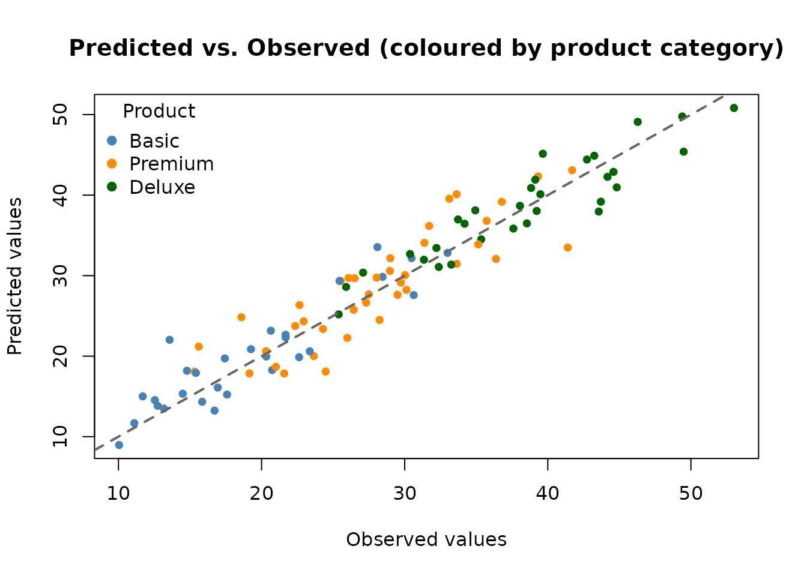

# Using Categorical Covariates with AddiVortes

This vignette explains how `AddiVortes` handles **categorical
covariates** — variables that take a discrete set of named levels, such
as region, product type, or treatment group. Because Voronoi
tessellations require numerical distances between points, categorical
variables must first be converted to numbers. `AddiVortes` does this
automatically using **one-hot encoding**, and this vignette explains the
encoding in detail.

### 1. What is One-Hot Encoding?

A categorical variable with *d* distinct levels cannot be treated as a
number because there is no natural ordering or magnitude between
categories. For example, assigning “North” = 1, “South” = 2, “East” = 3,
“West” = 4 would incorrectly imply that “West” is four times “North”.

**One-hot encoding** converts a categorical variable with *d* levels
into *d − 1* binary (0/1) indicator columns. One level is chosen as the
**reference level** (by convention, the first level in alphabetical
order), and the remaining *d − 1* levels each receive their own column:

| Level | `region_North` | `region_South` | `region_West` |
|-------|:--------------:|:--------------:|:-------------:|
| East  |       0        |       0        |       0       |
| North |       1        |       0        |       0       |
| South |       0        |       1        |       0       |
| West  |       0        |       0        |       1       |

The reference level (“East” here, as the alphabetically first) is
represented by all zeros. Using *d − 1* rather than *d* columns avoids
perfect collinearity while retaining full information about group
membership.

`AddiVortes` applies this encoding automatically to any column in `x`
that is of type `character` or `factor`. You do not need to pre-process
your data.

### 2. The `catScaling` Parameter

After one-hot encoding, each indicator column takes values 0 or 1, while
continuous covariates are normalised to the range \[−0.5, 0.5\]. If
`catScaling = 1` (the default), the binary jump from 0 to 1 has a
magnitude comparable to the full range of a normalised continuous
covariate, giving categorical and continuous covariates roughly equal
influence on the Voronoi tessellation distances.

You can adjust this with the `catScaling` argument:

- **`catScaling > 1`**: gives categorical differences *more* weight than
  continuous differences.
- **`catScaling < 1`**: gives categorical differences *less* weight,
  making the model rely more heavily on continuous covariates.

The column name for each binary indicator follows the pattern
`<original_column>_<level>`. For example, a column `region` with levels
`"East"`, `"North"`, `"South"`, `"West"` produces columns
`region_North`, `region_South`, `region_West` (with `"East"` as
reference).

### 3. A Synthetic Example

We create a dataset of 400 observations with two continuous covariates
and two categorical covariates. The response variable depends on all
four:

``` r
library(AddiVortes)

set.seed(123)
n <- 400

x <- data.frame(
  age = rnorm(n, mean = 40, sd = 10),
  income = runif(n, 20, 120), # income in thousands
  region = sample(c("East", "North", "South", "West"), n, replace = TRUE),
  product = sample(c("Basic", "Premium", "Deluxe"), n, replace = TRUE),
  stringsAsFactors = FALSE
)

# True response: depends on continuous and categorical variables
region_effect <- ifelse(x$region == "North", 5,
  ifelse(x$region == "South", -5, 0)
)
product_effect <- ifelse(x$product == "Premium", 10,
  ifelse(x$product == "Deluxe", 20, 0)
)

y <- 0.3 * x$age +
  0.1 * x$income +
  region_effect +
  product_effect +
  rnorm(n, sd = 3)
```

Note that `region` has 4 levels and `product` has 3 levels. When passed
to `AddiVortes` as character columns, they will be encoded as 3 and 2
binary columns respectively — for a total of 5 extra columns alongside
the 2 continuous covariates.

### 4. Inspecting the Encoding

We can call the internal encoding function directly to see exactly what
the encoded matrix looks like before fitting the model.

``` r
# Show the first few rows of x before encoding
head(x, 5)
#>        age   income region product
#> 1 34.39524 67.06818   East Premium
#> 2 37.69823 56.58455   West   Basic
#> 3 55.58708 32.12721  North Premium
#> 4 40.70508 24.69937   East Premium
#> 5 41.29288 46.27963   East   Basic
```

``` r
# Manually inspect the encoding applied by AddiVortes
enc_result <- AddiVortes:::encodeCategories_internal(x, catScaling = 1)
head(enc_result$encoded, 5)
#>           age   income region_North region_South region_West product_Deluxe
#> [1,] 34.39524 67.06818            0            0           0              0
#> [2,] 37.69823 56.58455            0            0           1              0
#> [3,] 55.58708 32.12721            1            0           0              0
#> [4,] 40.70508 24.69937            0            0           0              0
#> [5,] 41.29288 46.27963            0            0           0              0
#>      product_Premium
#> [1,]               1
#> [2,]               0
#> [3,]               1
#> [4,]               1
#> [5,]               0
```

The columns produced are: - `age` and `income` (unchanged continuous
columns) - `region_North`, `region_South`, `region_West` (3 indicators;
“East” is the reference) - `product_Deluxe`, `product_Premium` (2
indicators; “Basic” is the reference)

All binary columns take values 0 or `catScaling` (here 1). When
`catScaling = 1` all indicator columns and the continuous columns span a
comparable range inside the model.

### 5. Fitting the Model

Fitting the model is identical to the standard workflow — simply pass
the data frame with character or factor columns directly. `AddiVortes`
handles the encoding internally.

``` r
# Split into training and test sets
set.seed(42)
train_idx <- sample(n, 300)

x_train <- x[train_idx, ]
y_train <- y[train_idx]
x_test <- x[-train_idx, ]
y_test <- y[-train_idx]

fit <- AddiVortes(
  y = y_train,
  x = x_train,
  m = 50,
  totalMCMCIter = 500,
  mcmcBurnIn = 100,
  catScaling = 1, # default: binary columns span [0, 1]
  showProgress = FALSE
)
```

``` r
cat("In-sample RMSE:", round(fit$inSampleRmse, 3), "\n")
#> In-sample RMSE: 2.393

# The catEncoding field records how the encoding was built
cat("\nReference levels used:\n")
#> 
#> Reference levels used:
for (j in fit$catEncoding$catColIndices) {
  orig_col <- fit$catEncoding$origColNames[j]
  ref_lev <- fit$catEncoding$colEncodings[[j]]$levels[1]
  all_lev <- fit$catEncoding$colEncodings[[j]]$levels
  cat(
    " ", orig_col, ": reference =", ref_lev,
    "| all levels:", paste(all_lev, collapse = ", "), "\n"
  )
}
#>   region : reference = East | all levels: East, North, South, West 
#>   product : reference = Basic | all levels: Basic, Deluxe, Premium
```

The encoding metadata is stored in `fit$catEncoding` and is
automatically used when making predictions, so new data passed to
[`predict()`](https://rdrr.io/r/stats/predict.html) is encoded with
exactly the same reference levels.

### 6. Making Predictions

Predictions on new data work in the usual way. If the new data contains
the same categorical levels as the training data, the encoding is
applied consistently.

``` r
preds <- predict(fit, x_test, showProgress = FALSE)
```

``` r
rmse_test <- sqrt(mean((y_test - preds)^2))
cat("Test RMSE:", round(rmse_test, 3), "\n")
#> Test RMSE: 2.883
```

``` r
# Colour observations by product category
prod_cols <- c("Basic" = "steelblue", "Premium" = "darkorange", "Deluxe" = "darkgreen")
point_cols <- prod_cols[x_test$product]

plot(y_test, preds,
  col = point_cols, pch = 19, cex = 0.8,
  xlab = "Observed values",
  ylab = "Predicted values",
  main = "Predicted vs. Observed (coloured by product category)"
)
abline(0, 1, lwd = 2, lty = 2, col = "grey40")
legend("topleft",
  legend = names(prod_cols),
  col = prod_cols,
  pch = 19, title = "Product", bty = "n"
)
```



### 7. Handling Unseen Category Levels

At prediction time, if a new observation contains a category level that
was not seen during training, `AddiVortes` treats it as the **reference
level** (all binary indicators set to zero). This is a sensible default:
the model cannot infer anything about a previously unseen level and
falls back to the baseline.

``` r
# Create a test point with an unseen product level "Luxury"
x_new <- data.frame(
  age = 45,
  income = 80,
  region = "North",
  product = "Luxury", # unseen level
  stringsAsFactors = FALSE
)
```

``` r
pred_new <- predict(fit, x_new, showProgress = FALSE)
```

``` r
cat(
  "Prediction for unseen category 'Luxury' (treated as 'Basic'):",
  round(pred_new, 3), "\n"
)
#> Prediction for unseen category 'Luxury' (treated as 'Basic'): 25.783
```

### 8. Effect of `catScaling`

The `catScaling` parameter controls how much influence categorical
differences have in the distance calculations. Here we fit two models —
one with `catScaling = 1` (equal weight) and one with `catScaling = 2`
(double weight for categorical differences) — and compare their test
RMSEs.

``` r
fit_cs2 <- AddiVortes(
  y = y_train,
  x = x_train,
  m = 50,
  totalMCMCIter = 500,
  mcmcBurnIn = 100,
  catScaling = 2, # give categorical differences twice as much weight
  showProgress = FALSE
)
```

``` r
preds_cs2 <- predict(fit_cs2, x_test, showProgress = FALSE)
```

``` r
cat("Test RMSE (catScaling = 1):", round(rmse_test, 3), "\n")
#> Test RMSE (catScaling = 1): 2.883
cat("Test RMSE (catScaling = 2):", round(sqrt(mean((y_test - preds_cs2)^2)), 3), "\n")
#> Test RMSE (catScaling = 2): 2.955
```

In this example, the true response has substantial category effects (up
to ±20 units for product type) relative to the continuous effects, so
increasing `catScaling` may help the model focus more on categorical
group membership.

### 9. Summary of Key Points

- Pass `character` or `factor` columns directly in the covariate data
  frame; `AddiVortes` encodes them automatically.
- **One-hot encoding**: a categorical variable with *d* levels is
  converted to *d − 1* binary (0/1) indicator columns.
- The **reference level** is the alphabetically first level; all its
  indicators are zero.
- Indicator columns are named `<original_column>_<level>`
  (e.g. `product_Premium`).
- **`catScaling`** (default 1) controls the weight given to categorical
  differences relative to continuous differences. Increase it to give
  categories more influence; decrease it to give them less.
- The encoding metadata is stored in `fit$catEncoding` and applied
  automatically to new data in
  [`predict()`](https://rdrr.io/r/stats/predict.html).
- Unseen category levels at prediction time are treated as the reference
  level.
