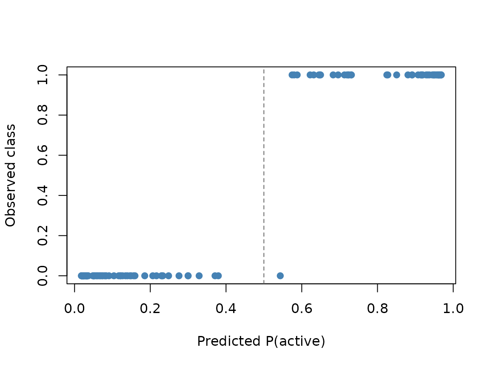

# Classification with AddiVortes

This vignette shows how
[`AddiVortes()`](https://johnpaulgosling.github.io/AddiVortes/reference/AddiVortes.md)
fits **binary** and **multi-category** classification models. The task
is chosen automatically from the response `y`. Binary classification
uses a probit link with Albert-Chib latent variables. Multi-category
classification uses the same idea with $`K-1`$ independent latent
ensembles (the first class is the reference level).

``` r

library(AddiVortes)
```

## How the response is interpreted

[`AddiVortes()`](https://johnpaulgosling.github.io/AddiVortes/reference/AddiVortes.md)
looks only at `y`:

- A **factor**, **character** or **logical** vector is classification.
  Two levels give a binary model; three or more give a multinomial
  model.
- A **numeric** vector with exactly two unique values in `{0, 1}` is
  binary classification (1 is the event class).
- Any other numeric vector is Gaussian regression, as in previous
  versions of the package.

The first factor level is the reference class, matching
[`glm()`](https://rdrr.io/r/stats/glm.html). For numeric 0/1 data, 0 is
the reference. Character vectors are converted with
[`factor()`](https://rdrr.io/r/base/factor.html), so levels are
alphabetical.

Missing values in `y` are not allowed, and a classification response
must have at least two classes.

## Binary classification

We simulate a two-dimensional problem whose labels follow a simple
linear boundary.

``` r

set.seed(2026)
n <- 120
x <- data.frame(
  x1 = runif(n, -1, 1),
  x2 = runif(n, -1, 1)
)
y <- factor(ifelse(x$x1 + x$x2 > 0, "active", "inactive"),
            levels = c("inactive", "active"))

fit_bin <- AddiVortes(
  y, x,
  m = 200,
  totalMCMCIter = 2000,
  mcmcBurnIn = 500,
  showProgress = FALSE
)

fit_bin$task
#> [1] "binary"
fit_bin$classLevels
#> [1] "inactive" "active"
fit_bin$inSampleAccuracy
#> [1] 0.9916667
```

`predict(..., type = "response")` returns the posterior mean of
$`\Phi(G(x))`$, the probability of the event class (`active` here).
`type = "class"` returns labels, and `type = "quantile"` gives credible
intervals for those probabilities.

``` r

p_hat <- predict(fit_bin, x, type = "response", showProgress = FALSE)
y_hat <- predict(fit_bin, x, type = "class", showProgress = FALSE)
p_int <- predict(fit_bin, x,
  type = "quantile",
  quantiles = c(0.05, 0.95),
  showProgress = FALSE
)

mean(y_hat == y)
#> [1] 0.9916667
range(p_hat)
#> [1] 0.01799616 0.96853534
head(cbind(prob = round(p_hat, 3), lower = round(p_int[, 1], 3),
           upper = round(p_int[, 2], 3), class = as.character(y_hat)))
#>      prob    lower   upper   class     
#> [1,] "0.724" "0.467" "0.921" "active"  
#> [2,] "0.048" "0.004" "0.141" "inactive"
#> [3,] "0.091" "0.011" "0.243" "inactive"
#> [4,] "0.713" "0.438" "0.92"  "active"  
#> [5,] "0.3"   "0.088" "0.565" "inactive"
#> [6,] "0.033" "0"     "0.13"  "inactive"
```

Observations with probability near 0.5 are the most uncertain. The 90%
intervals typically cover 0.5 for those points.

``` r

plot(p_hat, as.integer(y) - 1,
     xlab = "Predicted P(active)",
     ylab = "Observed class",
     pch = 19, col = "steelblue")
abline(v = 0.5, lty = 2, col = "grey40")
```



## Multi-category classification

With three or more classes, AddiVortes fits $`K-1`$ latent ensembles.
The argument `m` is the number of tessellations **per latent**, so a
three-class model with `m = 15` uses 30 tessellations in total.

``` r

set.seed(2026)
n3 <- 90
x3 <- data.frame(
  x1 = rnorm(n3),
  x2 = rnorm(n3)
)
y3 <- cut(x3$x1, breaks = c(-Inf, -0.5, 0.5, Inf), labels = c("low", "mid", "high"))

fit_multi <- AddiVortes(
  y3, x3,
  m = 200,
  totalMCMCIter = 2000,
  mcmcBurnIn = 500,
  showProgress = FALSE
)

fit_multi$task
#> [1] "multinomial"
fit_multi$nLatents
#> [1] 2
fit_multi$inSampleAccuracy
#> [1] 0.9888889
```

`type = "response"` is now an $`n \times K`$ matrix of class
probabilities. Rows sum to 1. `type = "class"` returns the class with
the largest probability.

``` r

p3 <- predict(fit_multi, x3, type = "response", showProgress = FALSE)
cls3 <- predict(fit_multi, x3, type = "class", showProgress = FALSE)

head(round(p3, 3))
#>        low   mid  high
#> [1,] 0.129 0.400 0.472
#> [2,] 0.682 0.230 0.088
#> [3,] 0.126 0.685 0.189
#> [4,] 0.195 0.671 0.135
#> [5,] 0.453 0.389 0.158
#> [6,] 0.843 0.107 0.050
mean(abs(rowSums(p3) - 1) < 1e-8)
#> [1] 1
table(predicted = cls3, observed = y3)
#>          observed
#> predicted low mid high
#>      low   30   0    0
#>      mid    0  34    1
#>      high   0   0   25
```

## Notes on the classification prior

On the latent probit scale the residual variance is fixed at
$`\sigma = 1`$, so `nu`, `q` and `InitialSigma` are ignored. Cell means
use

``` math
\sigma_\mu = \frac{3}{k\sqrt{m}},
```

which keeps $`G(x)`$ typically inside $`(-3, 3)`$ and shrinks class
probabilities towards 0.5 (or towards equal class probabilities in the
multinomial case). The default `k = 3` is a reasonable starting point.

The response itself is not scaled. Covariates are still centred and
scaled exactly as in regression.

For further details of the binary model see Stone, Ogundimu and Gosling
(2026). The multi-category construction follows the latent-utility setup
of Kindo, Wang and Peña (2016), with independent latents
($`\Sigma = I`$).
