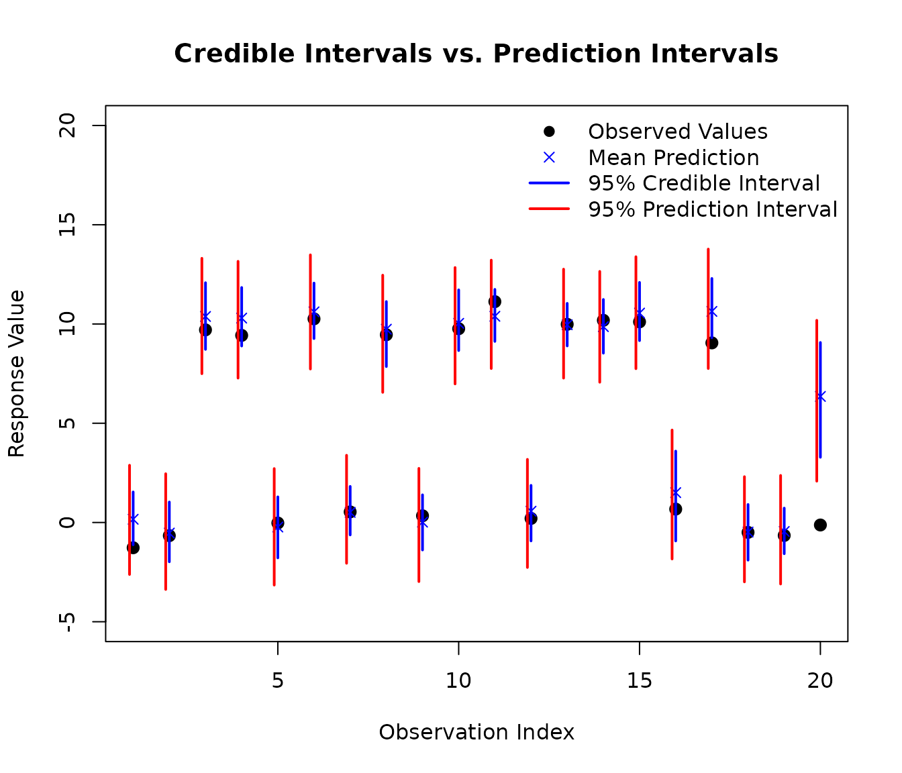

# Bayesian Regression and Prediction with AddiVortes

This vignette demonstrates the Bayesian regression and prediction
capabilities of the `AddiVortes` package. As a machine learning
alternative to BART, AddiVortes excels at non-parametric regression
using Voronoi tessellations. We will create a synthetic dataset with a
known underlying structure, fit a Bayesian regression model, and then
evaluate its predictive performance on new, unseen data.

### 1. Generating a synthetic dataset

We start by creating a 5-dimensional dataset. The response variable `Y`
is determined by a simple rule based on the first two predictors,
`X[,1]` and `X[,2]`, plus some random noise. This allows us to know the
“true” data-generating process, which is useful for evaluating the
model.

``` r
# Load the package
library(AddiVortes)

# --- Generate Training Data ---
set.seed(42) # for reproducibility

# Create a 5-column matrix of predictors
X <- matrix(runif(2500), ncol = 5)
X[,1] <- -10 - X[,1] * 10
X[,2] <- X[,2] * 100
X[,3] <- -9 + X[,3] * 10
X[,4] <- 8 + X[,4]
X[,5] <- X[,5] * 10

# Create the response 'Y' based on a rule and add noise
Y_underlying <- ifelse(-1 * X[,2] > 10 * X[,1] + 100, 10, 0)
Y <- Y_underlying + rnorm(length(Y_underlying))

# Visualise the relationships in the data
# The colours show the two underlying groups
pairs(X, 
      col = ifelse(Y_underlying == 10, "red", "blue"),
      pch = 19, cex = 0.5,
      main = "Structure of Predictor Variables")
```


### 2. Fitting the AddiVortes Model

Next, we fit an `AddiVortes` model to our training data. For this
example, we’ll use a small number of trees (`m=50`) for a quick
demonstration.

``` r
# Fit the model
AModel <- AddiVortes(Y, X, m = 50, showProgress = FALSE)
```

``` r
# We can check the in-sample Root Mean Squared Error
cat("In-sample RMSE:", AModel$inSampleRmse, "\n")
#> In-sample RMSE: 0.8454648
```

The in-sample RMSE gives us an idea of how well the model fits the data
it was trained on. However, the true test of a model is its performance
on new data.

### 3. Out-of-Sample Prediction

To evaluate the model’s predictive power, we generate a new
“out-of-sample” test set using the same process as before. We then use
the [`predict()`](https://rdrr.io/r/stats/predict.html) method on our
fitted model (`AModel`) to get predictions for this new data.

``` r
# --- Generate Test Data ---
set.seed(101) # Use a different seed for the test set
testX <- matrix(runif(1000), ncol = 5)
testX[,1] <- -10 - testX[,1] * 10
testX[,2] <- testX[,2] * 100
testX[,3] <- -9 + testX[,3] * 10
testX[,4] <- 8 + testX[,4]
testX[,5] <- testX[,5] * 10

# Create the true test response values
testY_underlying <- ifelse(-1 * testX[,2] > 10 * testX[,1] + 100, 10, 0)
testY <- testY_underlying + rnorm(length(testY_underlying))

# --- Make Predictions ---
# Predict the mean response
preds <- predict(AModel, testX,
                 showProgress = FALSE)

# Predict the 90% credible interval (from 0.05 to 0.95 quantiles)
# By default, this uses interval = "credible" which only accounts for
# uncertainty in the mean function
preds_q <- predict(AModel, testX,
                   "quantile", c(0.05, 0.95), showProgress = FALSE)

# For prediction intervals that also include the model's error variance
# (similar to lm's prediction intervals), use interval = "prediction"
# preds_q_pred <- predict(AModel, testX,
#                         "quantile", c(0.05, 0.95), 
#                         interval = "prediction",
#                         showProgress = FALSE)
```

### 4. Visualising Prediction Performance

A plot is an effective way to visualise the model’s performance. We will
plot the observed values from our test set against the model’s predicted
mean values.

The red lines on the plot represent the true, underlying mean values (0
and 10) from our data-generating process. A good model should produce
predictions that cluster around these lines. The blue vertical segments
represent the 90% credible intervals for each prediction, giving us a
sense of the model’s uncertainty.

``` r
# Plot observed vs. predicted values
plot(testY,
     preds,
     xlab = "Observed Values",
     ylab = "Predicted Mean Values",
     main = "Out-of-Sample Prediction Performance",
     xlim = range(c(testY, preds_q)),
     ylim = range(c(testY, preds_q)),
     pch = 19, col = "darkblue"
)

# Add error lines for the 90% credible interval
for (i in 1:nrow(preds_q)) {
  segments(testY[i], preds_q[i, 1],
           testY[i], preds_q[i, 2],
           col = rgb(0, 0, 0.5, 0.5), lwd = 1.5
  )
}

# Add lines showing the true underlying means
lines(c(min(testY)-0.2, 3), c(0, 0), col = "pink", lwd = 3, lty = 2)
lines(c(7, max(testY)+0.2), c(10, 10), col = "pink", lwd = 3, lty = 2)

# Add a legend
legend("bottomright",
       legend = c("Predicted Mean & 90% Interval",
                  "True Underlying Mean"),
       col = c("darkblue", "pink"),
       pch = c(19, NA),
       lty = c(1, 2),
       lwd = c(1.5, 3),
       bty = "n"
)
```


This plot shows that the model has successfully learned the underlying
structure of the data with predictions clustering correctly around the
true mean values of 0 and 10.

### 5. Credible Intervals vs. Prediction Intervals

The [`predict()`](https://rdrr.io/r/stats/predict.html) method supports
two types of intervals, similar to R’s built-in `lm` function:

- **Credible intervals** (`interval = "credible"`, the default): These
  reflect uncertainty in the **mean function** E\[Y\|X\]. They account
  for posterior sampling variability and uncertainty in the tessellation
  structure, but do not include the inherent noise in individual
  observations.

- **Prediction intervals** (`interval = "prediction"`): These include
  both the uncertainty in the mean function AND the model’s error
  variance (σ²). This makes them more appropriate for predicting
  individual future observations.

Let’s compare these two types of intervals on a subset of test data:

``` r
# Use a subset of test data for clearer visualization
subset_indices <- 1:20
testX_subset <- testX[subset_indices, ]
testY_subset <- testY[subset_indices]

# Get credible intervals (uncertainty in mean only)
cred_intervals <- predict(AModel, testX_subset,
                         type = "quantile",
                         interval = "credible",
                         quantiles = c(0.025, 0.975),
                         showProgress = FALSE)

# Get prediction intervals (includes error variance)
pred_intervals <- predict(AModel, testX_subset,
                         type = "quantile",
                         interval = "prediction",
                         quantiles = c(0.025, 0.975),
                         showProgress = FALSE)

# Get mean predictions
mean_preds <- predict(AModel, testX_subset,
                     type = "response",
                     showProgress = FALSE)

# Create comparison plot
plot(1:length(testY_subset), testY_subset,
     xlab = "Observation Index",
     ylab = "Response Value",
     main = "Credible Intervals vs. Prediction Intervals",
     pch = 19, col = "black", cex = 1.2, ylim = c(-5,20))

# Add mean predictions
points(1:length(testY_subset), mean_preds, pch = 4, col = "blue", cex = 1)

# Add credible intervals (narrower, in blue)
for (i in 1:length(testY_subset)) {
  segments(i, cred_intervals[i, 1],
           i, cred_intervals[i, 2],
           col = "blue", lwd = 2)
}

# Add prediction intervals (wider, in red)
for (i in 1:length(testY_subset)) {
  segments(i - 0.1, pred_intervals[i, 1],
           i - 0.1, pred_intervals[i, 2],
           col = "red", lwd = 2, lty = 1)
}

# Add legend
legend("topright",
       legend = c("Observed Values", "Mean Prediction",
                  "95% Credible Interval", "95% Prediction Interval"),
       col = c("black", "blue", "blue", "red"),
       pch = c(19, 4, NA, NA),
       lty = c(NA, NA, 1, 1),
       lwd = c(NA, NA, 2, 2),
       bty = "n")
```



As you can see in the plot, the prediction intervals (red) are wider
than the credible intervals (blue). This is because prediction intervals
account for both:

1.  **Epistemic uncertainty**: Our uncertainty about the true mean
    function (captured by the credible interval)
2.  **Aleatoric uncertainty**: The inherent random noise in individual
    observations (the additional width in prediction intervals)

We can quantify this difference:

``` r
# Calculate average interval widths
cred_width <- mean(cred_intervals[, 2] - cred_intervals[, 1])
pred_width <- mean(pred_intervals[, 2] - pred_intervals[, 1])

cat("Average 95% credible interval width:", round(cred_width, 2), "\n")
#> Average 95% credible interval width: 3
cat("Average 95% prediction interval width:", round(pred_width, 2), "\n")
#> Average 95% prediction interval width: 5.27
cat("Ratio (prediction/credible):", round(pred_width / cred_width, 2), "\n")
#> Ratio (prediction/credible): 1.76
```

**When to use each type:**

- Use **credible intervals** when you want to understand uncertainty
  about the mean response at a given set of predictor values (e.g.,
  “What is the average outcome for this type of case?”)

- Use **prediction intervals** when you want to predict individual
  future observations (e.g., “What range of outcomes should I expect for
  this specific new case?”)

This distinction is the same as in standard regression with `lm`, but
AddiVortes additionally captures complex non-linear relationships
through its tessellation-based approach.
