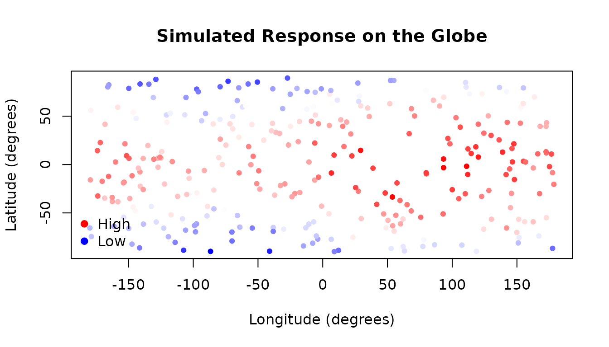
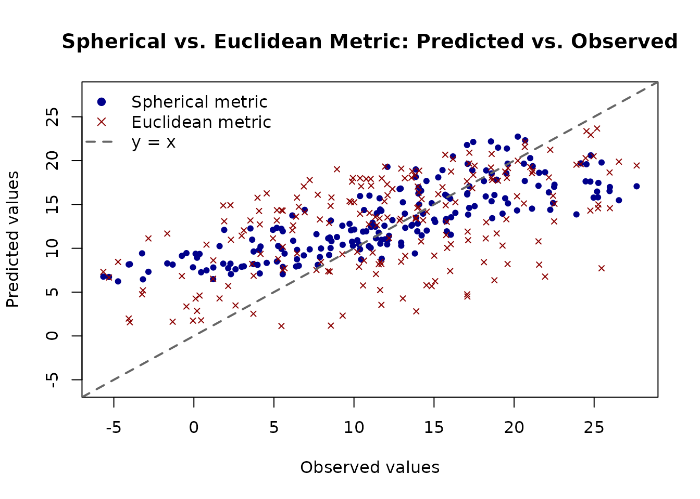
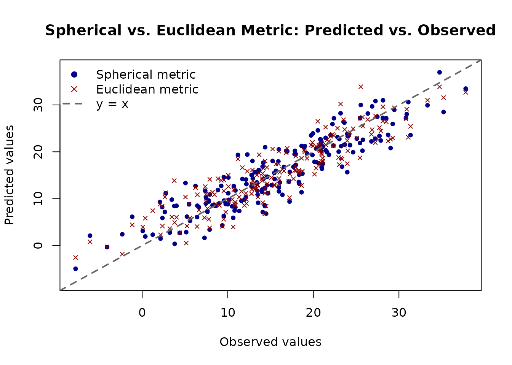

# Modelling Spherical Data with AddiVortes

This vignette demonstrates how to use `AddiVortes` with **spherical
data**, such as measurements taken at geographic locations on the
surface of a globe. Spherical data requires a specialised distance
measure because the usual Euclidean distance does not respect the
geometry of a curved surface — in particular it does not handle the
wrap-around at the poles and the date line correctly.

### 1. What is Spherical Data?

Spherical data are observations whose locations lie on the surface of a
sphere. A familiar example is geographic data specified by **latitude**
and **longitude**. Two important properties make this different from
ordinary planar data:

1.  **Wrap-around**: Longitude values near −180° and +180° are actually
    very close to each other on the globe, but their Euclidean distance
    is large. A good distance metric must recognise this.
2.  **Curvature**: Distances should follow great-circle arcs (the
    shortest path along the sphere’s surface) rather than straight
    lines.

`AddiVortes` uses the **great-circle distance** (also known as the
geodesic distance or the haversine-type formula) when `metric = "S"` is
specified. This ensures that points near the poles and near the date
line are treated as neighbours when they are genuinely close on the
sphere.

### 2. Coordinate Convention

`AddiVortes` expects spherical coordinates in **radians**, following
this convention:

- **Latitude-type dimensions** (all spherical dimensions except the
  last): values in \[−π/2, π/2\].
- **Longitude / azimuthal dimension** (the *last* spherical column):
  values in \[−π, π\].

For a single-surface model (a globe), you need exactly two columns:

    x <- cbind(latitude_rad, longitude_rad)

with `metric = "S"`. The model will use the spherical (great-circle)
distance between all pairs of tessellation centres and observations.

If your data combine spherical and non-spherical covariates, you can
pass a vector of metric indicators, e.g. `metric = c(1, 1, 0)` for two
spherical dimensions followed by one Euclidean dimension.

### 3. Generating Synthetic Spherical Data

We simulate a dataset of 300 observations distributed across the surface
of a globe. Each observation has a latitude and a longitude, and the
response variable represents a smoothly varying quantity — here, a
synthetic “temperature” that is warmest at the equator and varies with
longitude.

``` r

library(AddiVortes)

set.seed(42)
n <- 300

# Sample random locations on the globe
lat <- runif(n, -pi / 2, pi / 2) # latitude in radians: [-pi/2, pi/2]
lon <- runif(n, -pi, pi) # longitude in radians: [-pi, pi]

# True function: warmer at the equator, slight east-west gradient
y_true <- 20 * cos(lat) + 5 * sin(lon)

# Add observation noise
y <- y_true + rnorm(n, sd = 2)

# Covariate matrix: latitude first, longitude last (required convention)
x <- cbind(lat, lon)
```

The plot below shows the spatial distribution of the simulated response
values:

``` r

# Colour scale for the response
cols <- colorRampPalette(c("blue", "white", "red"))(100)
col_index <- cut(y, breaks = 100, labels = FALSE)

# Convert radians to degrees for a readable plot
lat_deg <- lat * 180 / pi
lon_deg <- lon * 180 / pi

plot(lon_deg, lat_deg,
  col = cols[col_index], pch = 19, cex = 0.7,
  xlab = "Longitude (degrees)",
  ylab = "Latitude (degrees)",
  main = "Simulated Response on the Globe"
)
legend("bottomleft",
  legend = c("High", "Low"),
  col = c("red", "blue"),
  pch = 19, bty = "n"
)
```



### 4. Fitting the Spherical Model

We fit `AddiVortes` with `metric = "S"` to tell the model that both
columns are spherical coordinates. The model will then use great-circle
distance when assigning observations to Voronoi cells.

``` r

fit_sph <- AddiVortes(
  y = y,
  x = x,
  m = 50,
  totalMCMCIter = 500,
  mcmcBurnIn = 100,
  metric = "S", # use great-circle distance for all columns
  showProgress = FALSE
)
```

``` r

cat("In-sample RMSE (spherical metric):", round(fit_sph$inSampleRmse, 3), "\n")
#> In-sample RMSE (spherical metric): 1.284
```

For comparison, we fit an identical model using the default
**Euclidean** metric. This model treats latitude and longitude as
ordinary continuous variables and will not handle the wrap-around near
±π correctly.

``` r

fit_euc <- AddiVortes(
  y = y,
  x = x,
  m = 50,
  totalMCMCIter = 500,
  mcmcBurnIn = 100,
  metric = "E", # Euclidean distance (default)
  showProgress = FALSE
)
```

``` r

cat("In-sample RMSE (Euclidean metric):", round(fit_euc$inSampleRmse, 3), "\n")
#> In-sample RMSE (Euclidean metric): 1.377
```

### 5. Out-of-Sample Evaluation

We generate a held-out test set and compare the two models. We also
include a group of observations near the date line (longitude ≈ ±π) to
highlight where the Euclidean metric is most likely to struggle.

``` r

set.seed(101)
n_test <- 200

lat_test <- runif(n_test, -pi / 2, pi / 2)
lon_test <- runif(n_test, -pi, pi)

y_true_test <- 20 * cos(lat_test) + 5 * sin(lon_test)
y_test <- y_true_test + rnorm(n_test, sd = 2)

x_test <- cbind(lat_test, lon_test)
```

``` r

preds_sph <- predict(fit_sph, x_test, showProgress = FALSE)
preds_euc <- predict(fit_euc, x_test, showProgress = FALSE)
```

``` r

rmse_sph <- sqrt(mean((y_test - preds_sph)^2))
rmse_euc <- sqrt(mean((y_test - preds_euc)^2))

cat("Test RMSE — spherical metric:", round(rmse_sph, 3), "\n")
#> Test RMSE — spherical metric: 5.536
cat("Test RMSE — Euclidean metric:", round(rmse_euc, 3), "\n")
#> Test RMSE — Euclidean metric: 4.82
```

### 6. Visualising Predictions

The plot below shows predicted versus observed values for both models on
the test set. A well-calibrated model should have points lying close to
the diagonal.

``` r

y_range <- range(c(y_test, preds_sph, preds_euc))

plot(y_test, preds_sph,
  pch = 19, col = "darkblue", cex = 0.7,
  xlab = "Observed values",
  ylab = "Predicted values",
  main = "Spherical vs. Euclidean Metric: Predicted vs. Observed",
  xlim = y_range, ylim = y_range
)
points(y_test, preds_euc, pch = 4, col = "darkred", cex = 0.7)
abline(0, 1, lwd = 2, lty = 2, col = "grey40")
legend("topleft",
  legend = c("Spherical metric", "Euclidean metric", "y = x"),
  col    = c("darkblue", "darkred", "grey40"),
  pch    = c(19, 4, NA),
  lty    = c(NA, NA, 2),
  lwd    = c(NA, NA, 2),
  bty    = "n"
)
```



### 7. Multiple Spherical Covariates

If the dataset contains covariates whose embedding is on separate
n-spheres, then these must be treated separately in `AddiVortes`. We
augment the data above to illustrate this.

``` r


lat_prime1 <- runif(n, -pi/2, pi/2)
lat_prime2 <- runif(n, -pi/2, pi/2)
lon_prime <- runif(n, -pi, pi)

y_prime_true <- 20 * cos(lat) + 5 * sin(lon) - 5 * cos(lat_prime1) * sin(lat_prime2) +
  10*sin(lon_prime)^2 * sin(abs(lat_prime1 - lat_prime2))
y_prime <- y_prime_true + rnorm(n, sd = 3)

x_prime <- cbind(lat, lon, lat_prime1, lat_prime2, lon_prime)
```

If we try to use `AddiVortes` as before, we will encounter an error,
since there are two azimuthal coordinates in the covariates.

``` r

fit_sph_new <- AddiVortes(
  y = y_prime,
  x = x_prime,
  m = 50,
  totalMCMCIter = 500,
  mcmcBurnIn = 100,
  metric = "S", # use great-circle distance for all columns
  showProgress = FALSE
)
#> Error in `covariateStructure_internal()`:
#> ! More than one spherical parameter in membership group 2 has range >pi.
```

To recitfy this, we provide `AddiVortes` with an additional argument,
`members`, which indicates which coordinates belong to which space: in
this case we give the first two coordinates membership 1, and the other
three membership 2.

``` r

fit_sph_new <- AddiVortes(
  y = y_prime,
  x = x_prime,
  m = 50,
  totalMCMCIter = 500,
  mcmcBurnIn = 100,
  metric = "S", # use great-circle distance for all columns,
  members = rep(1:2, times = c(2,3)), # indicate membership
  showProgress = FALSE
)
```

We follow the same process as before; fitting with Euclidean
coordinates, and comparing the results relative to a hold-out test set.

``` r

fit_euc_new <- AddiVortes(
  y = y_prime,
  x = x_prime,
  m = 50,
  totalMCMCIter = 500,
  mcmcBurnIn = 100,
  metric = "E", # Euclidean distance (default)
  showProgress = FALSE
)
```

``` r

## Set up test data
lat_prime_test1 <- runif(n_test, -pi/2, pi/2)
lat_prime_test2 <- runif(n_test, -pi/2, pi/2)
lon_prime_test <- runif(n_test, -pi, pi)

y_prime_test_true <- 20 * cos(lat_test) + 5 * sin(lon_test) - 5 * cos(lat_prime_test1) * sin(lat_prime_test2) +
  10*sin(lon_prime_test)^2 * sin(abs(lat_prime_test1 - lat_prime_test2))
y_prime_test <- y_prime_test_true + rnorm(n_test, sd = 3)

x_prime_test <- cbind(lat_test, lon_test, lat_prime_test1, lat_prime_test2, lon_prime_test)

## Make predictions
preds_prime_sph <- predict(fit_sph_new, x_prime_test, showProgress = FALSE)
preds_prime_euc <- predict(fit_euc_new, x_prime_test, showProgress = FALSE)

rmse_prime_sph <- sqrt(mean((y_prime_test - preds_prime_sph)^2))
rmse_prime_euc <- sqrt(mean((y_prime_test - preds_prime_euc)^2))

cat("Test RMSE — spherical metric:", round(rmse_prime_sph, 3), "\n")
#> Test RMSE — spherical metric: 3.595
cat("Test RMSE — Euclidean metric:", round(rmse_prime_euc, 3), "\n")
#> Test RMSE — Euclidean metric: 3.536

y_prime_range <- range(c(y_prime_test, preds_prime_sph, preds_prime_euc))

plot(y_prime_test, preds_prime_sph,
  pch = 19, col = "darkblue", cex = 0.7,
  xlab = "Observed values",
  ylab = "Predicted values",
  main = "Spherical vs. Euclidean Metric: Predicted vs. Observed",
  xlim = y_prime_range, ylim = y_prime_range
)
points(y_prime_test, preds_prime_euc, pch = 4, col = "darkred", cex = 0.7)
abline(0, 1, lwd = 2, lty = 2, col = "grey40")
legend("topleft",
  legend = c("Spherical metric", "Euclidean metric", "y = x"),
  col    = c("darkblue", "darkred", "grey40"),
  pch    = c(19, 4, NA),
  lty    = c(NA, NA, 2),
  lwd    = c(NA, NA, 2),
  bty    = "n"
)
```



### 8. Summary of Key Points

- Set `metric = "S"` (or `metric = "Spherical"`) to use the great-circle
  distance for **all** covariate columns.
- For datasets that mix spherical and non-spherical covariates, pass a
  vector of 0s and 1s, e.g. `metric = c(1, 1, 0)` for two spherical
  dimensions and one Euclidean dimension.
- For datasets with covariates taken from multiple different spherical
  coordinate systems, pass a vector of membership to indicate which
  belongs to which. For example, for five covariates where the first
  three are from S3 and the remaining two are from S2,
  `members = rep(1:2, times = c(3,2))`.
- Spherical coordinates must be in **radians**: latitude in \[−π/2,
  π/2\] and longitude in \[−π, π\].
- The **last** spherical column for each set is treated as the azimuthal
  (longitude) dimension; all other spherical columns are treated as
  polar (latitude) dimensions.
- The great-circle distance correctly handles wrap-around, so points
  near longitude ±π are recognised as neighbours.
